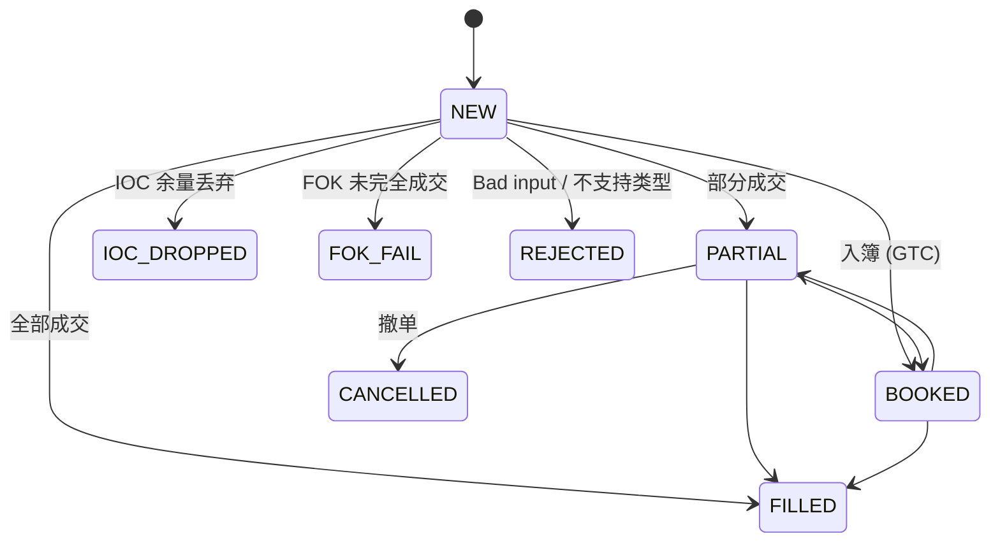

# order design
ScopeMatch — M0 Requirements & Design Document
1. Project Scope

Goal: Implement a minimal, single-threaded matching engine for educational purposes (C++ practice, order book mechanics, software design).

Scope: Supports only LIMIT orders, with time-in-force (TIF) policies GTC/IOC/FOK.

Not included: MARKET orders, risk checks, networking, CSV replay, multi-threading.

Value: Forms the foundation for later milestones (M1–M5), such as MARKET orders, replay CLI, O(1) cancel, concurrency, and performance tuning.

2. Functional Requirements
2.1 Add Order (add)

Input: OrderCmd (side, price, quantity, type, TIF, optional id_hint).

Behavior:

LIMIT + GTC: Fill as much as possible, remainder enters the order book.

LIMIT + IOC: Fill as much as possible, remainder is discarded (not booked).

LIMIT + FOK: If the full quantity cannot be filled immediately, the order is rejected (simplified in M0: no residue left in the book).

MARKET: Not supported in M0 → returns Status::REJECT.

Output: AddResult (status, order id, list of trades, filled qty, remaining qty).

2.2 Matching Rules

Price priority:

Buy orders match against asks with ask_price <= buy_price.

Sell orders match against bids with bid_price >= sell_price.

FIFO within price level: Orders at the same price are matched in arrival order.

Trade price: Always the passive order’s price (book price).

2.3 Cancel Order (cancel)

Input: order id.

Behavior: If the order is still resting in the book, remove it. If its price level becomes empty, remove that level.

Output: bool (true if canceled, false if not found).

Complexity: O(n) within price level (linear scan). → Will be upgraded to O(1) in M2.

2.4 Snapshot (snapshot)

Input: depth N.

Output: Top-N bids and asks (price + aggregated quantity).

3. Order Lifecycle (State Machine)

4. Deliverables for M0

Code: Minimal single-threaded matching engine in C++20.

Executable demo (main.cpp):

Seed orders into the book.

Place crossing orders and print trades.

Print top-3 snapshot after each action.

Tests: Basic functional checks (crossing, IOC discard, FOK fail, cancel).

Docs: This requirements document + inline code comments.
